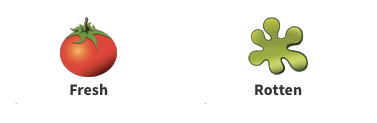

# Sentiment-Analysis-Movie-Review-Classification

Using data obtained from Rotten Tomatoes, we build models to classify the movie as a "fresh" or "rotten," i.e. good or bad.

We use n-gram bag of words representation and build vector models using CountVectorizer and TF-IDF Vectorizer. Naive Bayes classifier achieves a prediction accuracy of 74%, while Random Forest Classifiers achieves a prediction accuracy of 67%. Few of the top features obtained using this model include words like `touching, masterpiece, superb, moving` for a fresh review and words like `unfortunately, lame, problem, uninspired` for a rotten review. 
